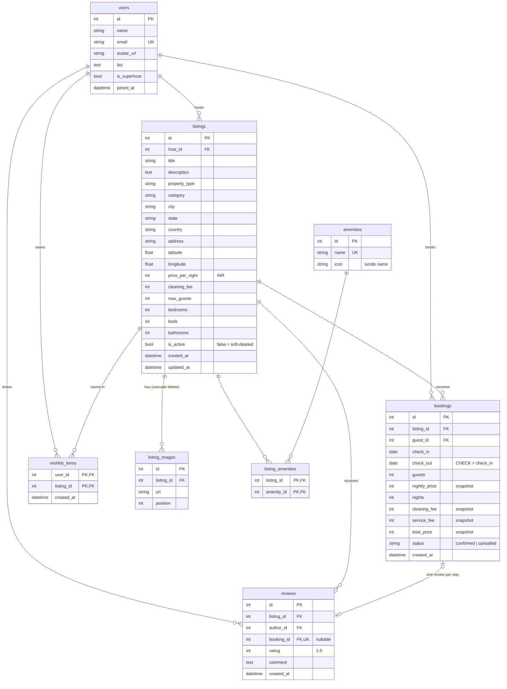

# Airbnb Clone

A full-stack Airbnb clone: browse and search homes, see listing details, book dates (no double-bookings), save wishlists, and switch to **hosting** to manage listings and reservations. The UI was built by measuring airbnb.co.in (sizes, spacing, colours) at 1440 and 1920 px wide. Payments, messaging and login are mocked.

| | |
|---|---|
| **Live app** | https://airbnb-clone-xk2g.vercel.app |
| **Live API** | https://airbnbclone-production-beea.up.railway.app (docs at `/docs`, health at `/api/health`) |
| **Code** | https://github.com/Mudrikaaa/Airbnb_clone |

> No sign-up needed: open the profile menu (top right) → **Log in as…** and pick a seeded user.
> Try **Rohan Gupta** (guest, has trips and a wishlist) and **Aarav Mehta** (Superhost, 7 listings and 30+ reservations).

## What you can do
- **Explore** — category row, Airbnb-style search bar (where / when / who), a Filters dialog (price slider, property type, rooms, amenities, live "Show N places" count), paginated grid. All filters live in the URL, so every view is shareable.
- **Listing page** — photo grid and gallery, amenities, 2-month availability calendar with booked nights struck through, sticky booking card with a server-calculated price breakdown, reviews, map, host card.
- **Book** — "Confirm and pay" (mock card form), instant confirmation, overlapping dates are rejected with a 409.
- **Trips / Wishlists** — upcoming, past and cancelled stays with cancel; hearts everywhere with optimistic updates.
- **Reviews** — after a completed stay, "Write a review" on Trips (1–5 stars + comment); the listing's rating updates straight away.
- **Become a host** — users without listings get "Become a host", an intro page and a one-question-per-screen create flow (Back / Next, progress bar); publishing makes them a host.
- **Host mode** — Today / Upcoming reservations with payouts, all reservations, a listings grid/table, and a create / edit form (photos by URL with preview and reorder) with delete rules.

## Tech stack
| Layer | Choice | Why |
|---|---|---|
| Frontend | Next.js 16 (App Router), React 19, TypeScript, Tailwind CSS v4 | Routing, Suspense and server metadata out of the box; design tokens in `tailwind.config.ts` |
| Data fetching | SWR | Cache keys include the user id, simple optimistic updates and infinite loading |
| UI libraries | `react-day-picker` + `date-fns` (calendars), `lucide-react` (icons), `sonner` (toasts), `react-leaflet` + OpenStreetMap tiles (map) | Each is used for one job only |
| Backend | Python 3.12, FastAPI, SQLAlchemy 2.0 (typed `Mapped[]` models), Pydantic v2, Uvicorn | Typed end to end; business rules live in plain service functions |
| Database | SQLite (file on a Railway volume in production) | Zero setup, enough for this scale; see assumptions |
| Tests | pytest (73 tests, in-memory SQLite) | Overlap rules, pricing, booking / host / search APIs, seed invariants, N+1 guards |
| Hosting | Vercel (frontend), Railway (backend + volume) | |

## Run it locally
You need **Python 3.11+** and **Node 20+**.

### Backend
```bash
cd backend
python -m venv .venv
.venv\Scripts\activate          # macOS/Linux: source .venv/bin/activate
pip install -r requirements.txt
cp .env.example .env            # Windows: copy .env.example .env
uvicorn app.main:app --reload --port 8000
```
On first start the tables are created and the database is **seeded automatically** (only when it is empty). API docs: http://localhost:8000/docs. Run the tests with `pytest`.

### Frontend
```bash
cd frontend
npm install
cp .env.example .env.local      # Windows: copy .env.example .env.local
npm run dev                     # http://localhost:3000
```
Checks: `npm run lint`, `npx tsc --noEmit`, `npm run build`.

### Environment variables
| Variable | Where | Local value | Production value |
|---|---|---|---|
| `DATABASE_URL` | backend | `sqlite:///./airbnb.db` | `sqlite:////data/airbnb.db` (Railway volume mounted at `/data`) |
| `FRONTEND_ORIGIN` | backend (CORS) | `http://localhost:3000` | `http://localhost:3000,https://airbnb-clone-xk2g.vercel.app` — comma-separated, exact origins, no trailing slash |
| `NEXT_PUBLIC_API_URL` | frontend | `http://localhost:8000` | `https://airbnbclone-production-beea.up.railway.app` — no trailing slash; it is baked in at build time, so **redeploy Vercel after changing it** |

`.env.example` files document all of these. Never commit real `.env` files (they are git-ignored).

## Architecture
```
 Browser ── Next.js (Vercel) ── fetch + X-User-Id header ──▶ FastAPI (Railway) ──▶ SQLite (/data volume)
```
The frontend never computes money or availability: prices come from `GET /listings/{id}/quote`, dates from `/availability`, and the booking endpoint re-checks everything on the server.

```
backend/
  app/
    main.py            app factory, CORS, error handlers, startup (create tables + seed if empty)
    config.py          settings from env vars (DATABASE_URL, FRONTEND_ORIGIN)
    db.py              engine, session, SQLite foreign keys switched on
    deps.py            get_current_user — mock auth from the X-User-Id header
    errors.py          domain errors -> {"detail": "..."} with the right status code
    models/            one file per aggregate: user, listing (+images, amenities), booking, review, wishlist
    schemas/           Pydantic request / response models
    routers/           thin: parse input, call a service, return the result
    services/          ** the business logic **
      availability.py  the single definition of "do two stays overlap" (Python + SQL versions)
      pricing.py       the single source of truth for prices (14% service fee, cleaning fee)
      search.py        filtered, paginated listing query (NOT EXISTS date filter, amenities = all)
      bookings.py / listings.py / reviews.py / wishlists.py / users.py
    seed/              idempotent seed (10 users, 49 listings, ~170 bookings, ~165 reviews, wishlists)
  scripts/check_images.py   HEAD-checks every seed image URL
  tests/
frontend/
  app/                 routes: /, /rooms/[id], /book/[id], /trips, /wishlists, /hosting/*, /experiences, /services
  components/          layout/ search/ listing/ listing-detail/ booking/ trips/ wishlist/ host/ ui/ auth/
  lib/                 api.ts (typed fetch + errors), types.ts, auth-context.tsx, search-params.ts (URL <-> filters), format.ts
```

**Where the rules live**
- *No double-booking*: `services/availability.py` defines overlap as `existing.check_in < new.check_out AND existing.check_out > new.check_in` (so check-out day is bookable as someone else's check-in). Only **confirmed** bookings block dates. `create_booking` checks before and again right after inserting, so two simultaneous requests can't both win; the loser gets **409**.
- *Prices*: `services/pricing.py` — `subtotal = nightly × nights`, `service fee = 14 % (rounded half up)`, `total = subtotal + cleaning + service`.
- *Ownership*: services raise 403 when a host touches someone else's listing; 401 when no user is sent.
- *No N+1 queries*: lists use `selectinload` / one aggregated subquery; tests assert the query count doesn't grow with the number of rows.

## Database schema

Integrity is enforced by the database itself, not only by the API: `CHECK (check_out > check_in)`, `CHECK (rating BETWEEN 1 AND 5)`, status `CHECK`, composite primary keys on the two link tables, a unique `reviews.booking_id` (one review per stay), foreign keys switched on for SQLite, and an index on `bookings(listing_id, check_in, check_out)` that serves the overlap query.

### Design decisions
- **Bookings store a price snapshot** (`nightly_price`, `cleaning_fee`, `service_fee`, `total_price`). If a host changes their price later, existing bookings, receipts and payouts must not change — so the numbers are copied at booking time instead of recalculated from the listing.
- **Ratings are aggregated in queries, not stored** on listings. A stored average can drift out of sync with the reviews; computing it on read (one grouped subquery joined to the listing list) can't. The trade-off is a little extra work per query, which is negligible at this size; a big site would cache the average on the listing and update it when a review is written.
- **Deletes are soft** (`is_active = false`). Guests' past trips and reviews still point at the listing, so a hard delete would break them (or erase history). A listing with **upcoming confirmed reservations can't be deleted at all** (409 with the reason). Deleted listings disappear from search, wishlists and the host's list, but remain in the database.

## API overview
All routes are under `/api`; errors are always `{"detail": "..."}` (422 also includes an `errors` list). "Optional" auth means the route works logged out and adds personal data (like `is_wishlisted`) when `X-User-Id` is sent.

| Method | Path | Auth | Purpose |
|---|---|---|---|
| GET | `/health` | – | Health check (touches the database) |
| GET | `/users` | – | Seeded users for the "Log in as…" menu |
| GET | `/users/me` | required | Current user |
| GET | `/meta/amenities` · `/meta/categories` · `/meta/property-types` | – | Filter vocabularies |
| GET | `/listings` | optional | Search: `location`, `check_in`/`check_out`, `guests`, `min_price`/`max_price`, `property_type` (comma list), `category`, `bedrooms`/`beds`/`bathrooms` (minimums), `amenities` (must have all), `page`, `page_size` |
| GET | `/listings/{id}` | optional | Detail: images, amenities, host stats, rating summary |
| GET | `/listings/{id}/availability` | – | Booked date ranges (for the calendar) |
| GET | `/listings/{id}/quote` | – | Price breakdown + whether the dates are free |
| GET / POST | `/listings/{id}/reviews` | – / required | Reviews; post only for your own completed stay |
| POST | `/listings` | required | Create a listing (you become its host) |
| PUT / DELETE | `/listings/{id}` | owner | Replace / soft-delete (409 if upcoming reservations) |
| POST | `/bookings` | required | Book; price recomputed server-side, 409 on overlap |
| GET | `/bookings/me` | required | My trips: upcoming / past / cancelled |
| POST | `/bookings/{id}/cancel` | guest | Cancel (up to the day before check-in) |
| GET | `/host/listings` · `/host/bookings` | required | My listings; bookings on my listings (with payout) |
| GET | `/wishlists` | required | Saved listings |
| PUT / DELETE | `/wishlists/{listing_id}` | required | Save / unsave (idempotent) |

## Assumptions and mocked parts
- **Login is mocked.** The frontend stores a user id in `localStorage` and sends it as `X-User-Id`; the backend trusts it. This is fine for a demo, **not** for production, where this single dependency (`deps.get_current_user`) would be replaced by sessions or JWTs.
- **Payments are mocked.** The card form checks the *format* only; nothing is charged or stored. Messaging, identity verification, the host Calendar and Messages tabs, and the **Experiences** and **Services** tabs are "coming soon" pages.
- **No migrations (Alembic).** Tables are created with `Base.metadata.create_all` on startup. The seed runs only when the database is empty, so restarts never duplicate data; `python -m app.seed.seed --reset` wipes and reseeds. Booking and review dates in the seed are generated relative to today, so there are always upcoming and past trips.
- **SQLite on one Railway volume** keeps bookings across restarts and avoids running a database server. It allows one writer at a time, which is why the booking endpoint re-checks for overlaps after inserting. Render's free disk would be ephemeral, so it isn't used.
- **Prices are whole rupees (INR)**, with a flat 14 % service fee and no taxes.
- **Photos** are Unsplash links chosen by theme (not photos of the real places), and all seed image URLs are verified by `scripts/check_images.py`. Host-added photos are URLs, not uploads.
- **Dates** are plain calendar dates with no timezone handling.

## What I would do next
1. Real authentication (sessions / JWT), then lock down `/users`.
2. Postgres + Alembic migrations, so the app can scale past one writer and evolve its schema.
3. Photo uploads to object storage, with image resizing.
4. Real payments (Stripe) and transactional emails; host / guest messaging.
5. Map-based search and a price histogram in Filters; text search with suggestions from real data.
6. Host replies to reviews and per-category ratings.
7. Browser tests (Playwright) for the booking and hosting flows, plus CI that runs lint, types, build and `pytest`.
8. A host calendar with blocked dates, custom prices and seasonal rates.

## Deployment
See [docs/DEPLOY.md](docs/DEPLOY.md) for the exact Vercel and Railway settings, the one-time production reset, and a smoke test for the deployed links.

## Credits
Header tab icons are [Fluent Emoji](https://github.com/microsoft/fluentui-emoji) 3D images by Microsoft, used under the MIT licence (`frontend/public/icons/`).
